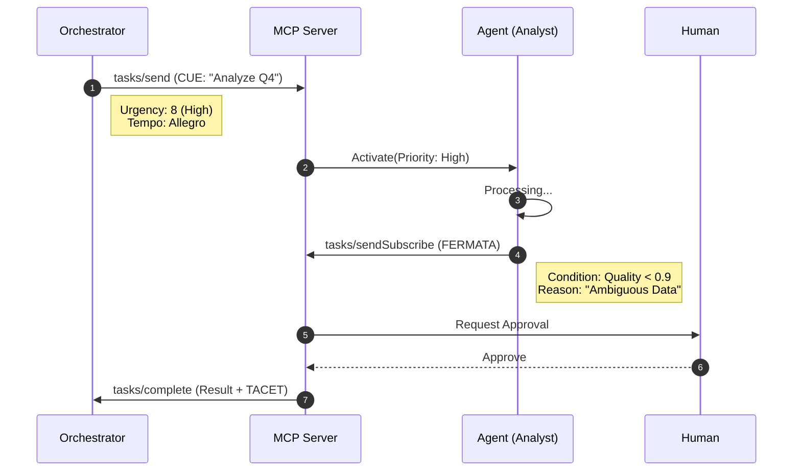

# HCT-MCP Signals

<div align="center">


### The Coordination Layer for Model Context Protocol

**Express Urgency, Timing, and Synchronization in Multi-Agent Systems.**

[](https://pypi.org/project/hct-mcp-signals/)
[](https://www.npmjs.com/package/@hct-mcp/signals)
[](https://crates.io/crates/hct-mcp-signals)
[](https://pkg.go.dev/github.com/stefanwiest/hct-mcp-signals/go)

</div>

---

## 🧠 The Problem

**MCP connects agents to tools, but how do agents coordinate _with each other_?**

Standard MCP messages (`tasks/send`) lack the vocabulary for:
- 🚨 **Urgency**: "Drop everything and process this now!"
- ⏱️ **Timing**: "I need this in < 500ms."
- ✋ **Approvals**: "Pause until a human signs off."
- 🔄 **Loops**: "Retry until quality > 90%."
- 🛑 **Sync**: "Wait here until everyone catches up."

Without these signals, developers build brittle, ad-hoc state machines.


## 💡 The Solution: Harmonic Coordination

**HCT-MCP Signals** extends the protocol with 7 musical primitives proven to coordinate complex ensembles without a central conductor.

| Signal | Semantics | Musical Analogy | Use Case |
|:---:|---|---|---|
| **CUE** | Act Now | Conductor's baton | Task dispatch, Urgent handoff |
| **FERMATA** | Hold | Held note | Human-in-the-loop, Approval gates |
| **ATTACCA** | Immediate | No pause between mvts | Real-time, Latency-critical flows |
| **VAMP** | Loop | Repeat phrase | Polling, Retrying, Quality checks |
| **CAESURA** | Stop | Full pause | Emergency shutdown, Reset |
| **TACET** | Silent | Rest | Resource conservation (sleep) |
| **DOWNBEAT** | Sync | First beat of bar | Global synchronization barriers |

---

## ⚡ Architecture

HCT Signals embed seamlessly into standard MCP JSON-RPC messages. Existing servers ignore them; enabled agents leverage them for high-fidelity coordination.



---

## 🚀 Installation

<div align="center">

| Language | Command |
|---|---|
| **Python** | `pip install hct-mcp-signals` |
| **Node.js** | `npm install @hct-mcp/signals` |
| **Rust** | `cargo add hct-mcp-signals` |
| **Go** | `go get github.com/stefanwiest/hct-mcp-signals/go` |

</div>

---

## 💻 Quick Start

### Python
```python
from hct_mcp_signals import cue, fermata

# 1. Dispatch with Urgency
signal = cue("orch", ["analyst"], urgency=9, tempo="presto")
mcp_client.send_tool_use("analyze", hct_signal=signal.to_mcp())

# 2. Hold for Approval
hold = fermata("analyst", "Needs Review", hold_type="human")
```

### TypeScript
```typescript
import { cue, Tempo } from '@hct-mcp/signals';

// 1. Dispatch with Urgency
const signal = cue({
    source: 'orch',
    targets: ['analyst'],
    urgency: 9,
    tempo: Tempo.PRESTO
});
```

### Rust
```rust
use hct_mcp_signals::{cue, Tempo};

// 1. Builder Pattern
let signal = cue("orch", ["analyst"])
    .with_urgency(9)
    .with_tempo(Tempo::Presto)
    .build();
```

---

## 🔌 Framework Integrations

<details>
<summary><strong>LangGraph (Python)</strong></summary>

```python
def router(state):
    signal = state.get("hct_signal")
    if signal.type == "fermata":
        return "human_node"
    return "tools"
```
</details>

<details>
<summary><strong>CrewAI (Python)</strong></summary>

```python
# Pass signals in task context
Task(
    description="Analyze",
    expected_output="Report",
    context={"hct_signal": cue("manager", ["worker"]).to_mcp()}
)
```
</details>

<details>
<summary><strong>Google ADK / GenAI</strong></summary>

```python
# HCT signals serve as 'routing metadata' in GenAI flows
class RoutingAgent(Agent):
    async def route(self, msg):
        if msg.hct_signal.is_urgent():
            await self.fast_lane.process(msg)
```
</details>

---

## 📜 Full Specification

The complete protocol specification is available in [RFC.md](./RFC.md).

## 🤝 Contributing

We welcome contributions! Please see [CONTRIBUTING.md](./CONTRIBUTING.md).

---

<div align="center">
    <sub>Built with ❤️ by the HCT Working Group</sub>
</div>

## License

[Apache License 2.0](LICENSE)
