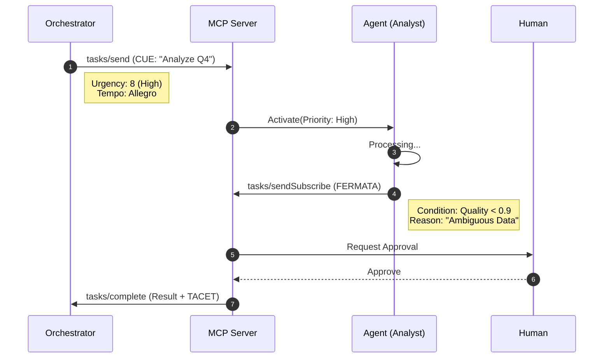

# HCT-MCP Signals

<div align="center">


### The Coordination Layer for Model Context Protocol

**Express Urgency, Timing, and Synchronization in Multi-Agent Systems.**

[](https://pypi.org/project/hct-mcp-signals/)
[](https://www.npmjs.com/package/@hct-mcp/signals)
[](https://crates.io/crates/hct-mcp-signals)
[](https://pkg.go.dev/github.com/stefanwiest/hct-mcp-signals/go)

</div>
<br/>

> [!NOTE] 
> **Status: Early Stage Public Preview**  
> **HCT-MCP Signals** is currently in **Public Preview**. The specification and implementations are functional but are still evolving. We are opening the project to foster collaboration, gather feedback, and solicit contributions. Expect changes.

---

## 🧠 The Problem

**MCP connects agents to tools, but how do agents coordinate _with each other_?**

Standard MCP messages (`tasks/send`) lack the vocabulary for:
- 🚨 **Urgency**: "Drop everything and process this now!"
- ⏱️ **Timing**: "I need this in < 500ms."
- ✋ **Approvals**: "Pause until a human signs off."
- 🔄 **Loops**: "Retry until quality > 90%."
- 🛑 **Sync**: "Wait here until everyone catches up."

Without these signals, developers build brittle, ad-hoc state machines.


## 💡 The Solution: Harmonic Coordination

**HCT-MCP Signals** extends the protocol with 7 musical primitives proven to coordinate complex ensembles without a central conductor.

| Signal | Semantics | Musical Analogy | Use Case |
|:---:|---|---|---|
| **CUE** | Act Now | Conductor's baton | Task dispatch, Urgent handoff |
| **FERMATA** | Hold | Held note | Human-in-the-loop, Approval gates |
| **ATTACCA** | Immediate | No pause between mvts | Real-time, Latency-critical flows |
| **VAMP** | Loop | Repeat phrase | Polling, Retrying, Quality checks |
| **CAESURA** | Stop | Full pause | Emergency shutdown, Reset |
| **TACET** | Silent | Rest | Resource conservation (sleep) |
| **DOWNBEAT** | Sync | First beat of bar | Global synchronization barriers |

---

## ⚡ Architecture

HCT Signals embed seamlessly into standard MCP JSON-RPC messages. Existing servers ignore them; enabled agents leverage them for high-fidelity coordination.



---

## 🚀 Installation

<div align="center">

| Language | Command |
|---|---|
| **Python** | `pip install hct-mcp-signals` |
| **Node.js** | `npm install @hct-mcp/signals` |
| **Rust** | `cargo add hct-mcp-signals` |
| **Go** | `go get github.com/stefanwiest/hct-mcp-signals/go` |

</div>

---

## 💻 Quick Start

### Python
```python
from hct_mcp_signals import cue, fermata

# 1. Dispatch with Urgency
signal = cue("orch", ["analyst"], urgency=9, tempo="presto")
mcp_client.send_tool_use("analyze", hct_signal=signal.to_mcp())

# 2. Hold for Approval
hold = fermata("analyst", "Needs Review", hold_type="human")
```

### TypeScript
```typescript
import { cue, Tempo } from '@hct-mcp/signals';

// 1. Dispatch with Urgency
const signal = cue({
    source: 'orch',
    targets: ['analyst'],
    urgency: 9,
    tempo: Tempo.PRESTO
});
```

### Rust
```rust
use hct_mcp_signals::{cue, Tempo};

// 1. Builder Pattern
let signal = cue("orch", ["analyst"])
    .with_urgency(9)
    .with_tempo(Tempo::Presto)
    .build();
```

---

## 🔌 Framework Integrations

HCT Signals are framework-agnostic. Here is how they enhance various agent architectures:

### LangGraph
```python
from langgraph.graph import StateGraph
from hct_mcp_signals import fermata, caesura

def router(state):
    signal = state.get("hct_signal", {})
    if signal.get("type") == "fermata":
        return "human_review"
    elif signal.get("type") == "caesura":
        return "end"
    return "continue"
```

### CrewAI
```python
from crewai import Task
from hct_mcp_signals import cue, vamp

# Embed HCT signal in task context for quality gating
Task(
    description="Analyze Q4 Trends",
    expected_output="Financial Report",
    context={"hct_signal": vamp("verifier", "confidence >= 0.9").to_mcp()}
)
```

### AutoGen
```python
from hct_mcp_signals import downbeat

# Sync point before parallel work
sync = downbeat("coordinator", "phase_2_start")
assistant.send({"content": "Starting phase 2", "hct_signal": sync.to_mcp()})
```

### Google ADK
```python
class CoordinatedAgent(Agent):
    async def on_message(self, message):
        signal = message.get("hct_signal")
        if signal and signal["type"] == "caesura":
            await self.emergency_shutdown(signal["payload"]["reason"])
```

### AWS Strands / Bedrock
```python
class StrandsCoordinatedAgent(Agent):
    def handle_mcp_message(self, params):
        signal = params.get("hct_signal")
        urgency = signal.get("performance", {}).get("urgency", 5)
        
        if urgency >= 8:
            return self.priority_process(params)
        return self.normal_process(params)
```

### DSPy
```python
class QualityControlledModule(dspy.Module):
    def forward(self, question):
        # Use VAMP signal for retry logic
        signal = vamp("dspy_module", "quality >= 0.9", quality_threshold=0.9)
        # Emit signal to observer...
        return self.generate(question)
```

### TensorZero
```python
@gateway.route
def route_with_urgency(request):
    signal = request.get("hct_signal", {})
    urgency = signal.get("performance", {}).get("urgency", 5)
    
    if urgency >= 9:
        return "fast_model"
    elif signal.get("type") == "fermata":
        return "careful_model"
    return "default_model"
```

### Letta (MemGPT)
```python
class MemoryCoordinatedAgent(Agent):
    def hibernate(self, duration_ms):
        # Signal agent is going inactive (TACET)
        signal = tacet(self.name, duration_ms=duration_ms)
        self.broadcast(signal.to_mcp())
```

---

## 📜 Full Specification

The complete protocol specification is available in [RFC.md](./RFC.md).

## 🤝 Contributing

Please see [CONTRIBUTING.md](./CONTRIBUTING.md).

---

## License

[Apache License 2.0](LICENSE)
